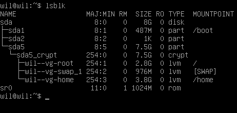
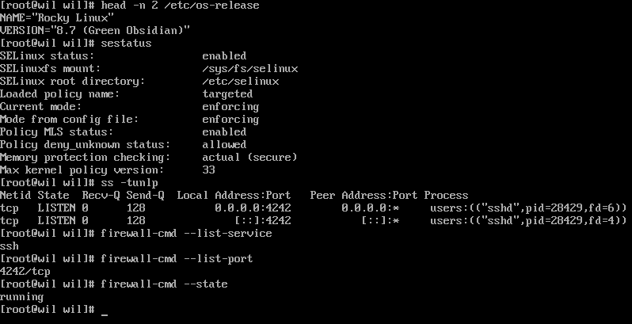
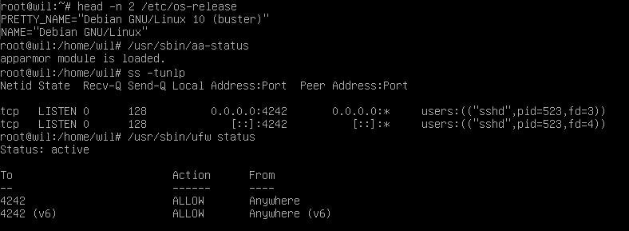
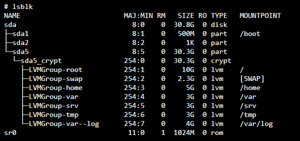

# Born2beRoot

This is a System Administration related exercise.


## Introduction

This project aims to introduce you to the wonderful world of virtualization.

You will create your first machine in `VirtualBox` (or `UTM` if you can't use `VirtualBox`)
under specific instructions.
Then, at the end of this project, you will be able to set up your own operating system while implementing strict rules.

## General Guidelines

- The use of `VirtualBox` (or `UTM` if you can't use `VirtualBox`) is mandatory.
- You only have to turn in a `signature.txt` file at the root of your repository.
You must paste in it the signature of your machine's virtual disk.

## Mandatory part

This project consists of having you set up your first server by following specific rules.

> ⚠️ Since it is a matter of setting up a server, you will install the minimum of services.
> For this reason, a graphical interface is of no use here.
> It is therefore forbidden to install X.org or any other equivalent graphics server.
> Otherwise, your grade will be 0.

You must choose as an operating system either the latest stable version of `Debian`
(no testing/unstable), or the latest stable version of `Rocky`.
`Debian` is highly recommended if you are new to system administration.

> ℹ️ Setting up Rocky is quite complex. Therefore, you don't have to set up KDump.
> However, SELinux must be running at startup and its configuration has to be adapted for the project's needs.
> AppArmor for Debian must be running at startup too.

You must create at least 2 encrypted partitions using `LVM`. Below is an example of the
expected partitioning:



> ℹ️ During the defense, you will be asked a few questions about the operating system you chose.
> For instance, you should know the differences between `aptitude` and `apt`, or what SELinux or AppArmor is.
> In short, understand what you use!

A `SSH` service will be running on port `4242` only.
For security reasons, it must not be possible to connect using `SSH` as root.

> ℹ️ The use of SSH will be tested during the defense by setting up a new account.
> You must therefore understand how it works.

You have to configure your operating system with the `UFW` (or `firewalld` for Rocky)
firewall and thus leave only port 4242 open.

> ℹ️ Your firewall must be active when you launch your virtual machine.
> For Rocky, you have to use `firewalld` instead of `UFW`.

The `hostname` of your virtual machine must be your login ending with 42 (e.g., `wil42`).
You will have to modify this hostname during your evaluation.

- You have to implement a strong password policy.
- You have to install and configure `sudo` following strict rules.
- In addition to the root user, a user with your login as username has to be present.
- This user has to belong to the `user42` and `sudo` groups.

> ℹ️ During the defense, you will have to create a new user and assign it to a group.

To set up a strong password policy, you have to comply with the following requirements:

- Your password has to expire every 30 days.
- The minimum number of days allowed before the modification of a password will be set to 2.
- The user has to receive a warning message 7 days before their password expires.
- Your password must be at least 10 characters long. It must contain an uppercase letter, a lowercase letter, and a number. Also, it must not contain more than 3 consecutive identical characters.
- The password must not include the name of the user.
- The following rule does not apply to the root password: The password must have at least 7 characters that are not part of the former password.
- Of course, your root password has to comply with this policy.

> ⚠️ After setting up your configuration files, you will have to change all the passwords of the accounts present on the virtual machine, including the root account.

To set up a strong configuration for your `sudo` group, you have to comply with the following requirements:

- Authentication using `sudo` has to be limited to 3 attempts in the event of an incor- rect password.
- A custom message of your choice has to be displayed if an error due to a wrong password occurs when using `sudo`.
- Each action using `sudo` has to be archived, both inputs and outputs. The log file has to be saved in the `/var/log/sudo/` folder.
- The `TTY` mode has to be enabled for security reasons.
- For security reasons too, the paths that can be used by `sudo` must be restricted.
	Example: `/usr/local/sbin:/usr/local/bin:/usr/sbin:/usr/bin:/sbin:/bin:/snap/bin`

Finally, you have to create a simple script called `monitoring.sh`. It must be developed in `bash`.

At server startup, the script will display some information (listed below) on all terminals every 10 minutes (take a look at `wall`).
The banner is optional. No error must be visible.

Your script must always be able to display the following information:

- The architecture of your operating system and its kernel version.
- The number of physical processors.
- The number of virtual processors.
- The current available RAM on your server and its utilization rate as a percentage.
- The current available memory on your server and its utilization rate as a percentage.
- The current utilization rate of your processors as a percentage.
- The date and time of the last reboot.
- Whether LVM is active or not.
- The number of active connections.
- The number of users using the server.
- The IPv4 address of your server and its MAC (Media Access Control) address.
- The number of commands executed with the `sudo` program.

> ℹ️ During the defense, you will be asked to explain how this script works.
> You will also have to interrupt it without modifying it.
> Take a look at cron.

This is an example of how the script is expected to work:

```
Broadcast message from root@wil (tty1) (Sun Apr 25 15:45:00 2021):

	#Architecture: Linux wil 4.19.0-16-amd64 #1 SMP Debian 4.19.181-1 (2021-03-19) x86_64 GNU/Linux
	#CPU physical : 1
	#vCPU : 1
	#Memory Usage: 74/987MB (7.50%) #Disk Usage: 1009/2Gb (49%)
	#CPU load: 6.7%
	#Last boot: 2021-04-25 14:45
	#LVM use: yes
	#Connections TCP : 1 ESTABLISHED
	#User log: 1
	#Network: IP 10.0.2.15 (08:00:27:51:9b:a5)
	#Sudo : 42 cmd
```

Below are two commands you can use to check some of the subject's requirements:

For Rocky:



For Debian:



## Bonus part

Bonus list:

- Set up partitions correctly so you get a structure similar to the one below:
	
- Set up a functional WordPress website with the following services: lighttpd, MariaDB, and PHP.
- Set up a service of your choice that you think is useful (NGINX / Apache2 excluded!).
	During the defense, you will have to justify your choice.

> ℹ️ To complete the bonus part, you have the possibility to set up extra services.
> In this case, you may open more ports to suit your needs.
> Of course, the UFW/Firewalld rules has to be adapted accordingly.

## Submission and peer-evaluation

You only have to turn in a `signature.txt` file at the root of your Git repository.
You must paste in it the signature of your machine's virtual disk.
To get this signature, you first have to open the default installation folder (it is the folder where your VMs are saved):

- Windows: `%HOMEDRIVE%%HOMEPATH%\VirtualBox VMs\`
- Linux: `~/VirtualBox VMs/`
- MacOS: `~/VirtualBox VMs/`
- Mac M1: `~/Library/Containers/com.utmapp.UTM/Data/Documents/`

Then, retrieve the signature from the `.vdi` file (or `.qcow2` for UTM users) of your virtual machine in `sha1` format.
Below are 4 command examples for a `rocky_serv.vdi` file:

- Windows: `certUtil -hashfile rocky_serv.vdi sha1`
- Linux: `sha1sum rocky_serv.vdi`
- MacOS: `shasum rocky_serv.vdi`
- Mac M1: `shasum rocky.utm/Images/disk-0.qcow2`

This is an example of what kind of output you will get:
- `6e657c4619944be17df3c31faa030c25e43e40af`

> ℹ️ Please note that your virtual machine's signature may be altered after your first evaluation.
> To solve this problem, you can duplicate your virtual machine or use save state.
